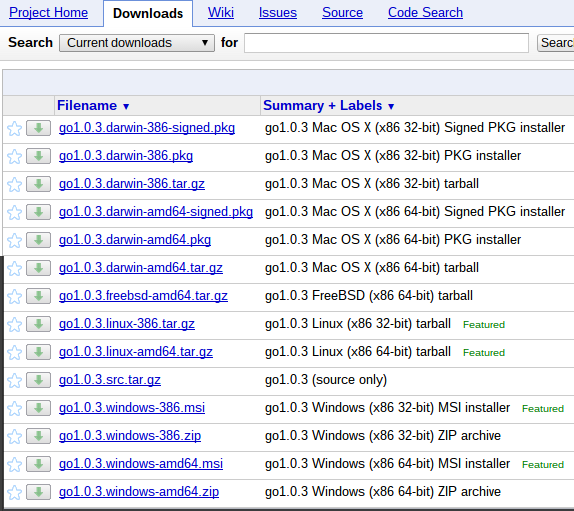

# Pengenalan Go

[[ Daftar Isi ]](README.md) [[ Awal ]](../README.md)

## Apa itu Go?

Go adalah nama bahasa pemrograman sekaligus nama implementasi dalam bentuk kompilator (`compiler`). Untuk pembahasan berikutnya, istilah `Go` akan mengacu juga pada spesifikasi bahasa pemrograman serta peranti pengembangannya.

## Lisensi Go

Go didistribusikan dengan menggunakan lisensi modifikasi dari BSD. Lisensi lengkap dari Go bisa diakses di [URL Lisensi Go](http://golang.org/LICENSE). Secara umum, penggunaaan lisensi ini mempunyai implikasi sebagai berikut:
* boleh digunakan untuk keperluan komersial maupun non-komersial tanpa batasan
* boleh memodifikasi sesuai keperluan
* boleh mendistribusikan
* boleh memberikan sublisensi ke pihak lain
* boleh memberikan garansi
* tidak boleh menggunakan merk dagang Go
* tanpa jaminan dan jika terjadi kerusakan terkait penggunaan software ini maka pemberi lisensi tidak bisa dituntut
jika mendistribusikan harus mengikutsertakan pemberitahuan hak cipta.

## Instalasi Go

### Distribusi Go

Go tersedia pada berbagai platform. Proyek Go sendiri secara resmi mendukung platform Linux, FreeBSD, MacOSX, dan Windows. Dukungan tersebut merupakan dukungan resmi dan distribusi `binary executable` dari berbagai platform tersebut tersedia di [repository downloads Go](http://golang.org/dl/) seperti bisa dilihat di gambar berikut:

Dengan dukungan tersebut, Proyek Go akan menerima laporan `bugs` terkait dengan distribusi pada berbagai platform tersebut. Meski demikian, bukan berarti platform-platform lain tidak bisa menggunakan Go karena distribusi dalam bentuk kode sumber tersedia dan telah berhasil dikompilasi ke berbagai platform: NetBSD, OpenBSD, DragonFlyBSD, dan lain-lain. Informasi mengenai platform-platform yang mungkin bisa digunakan oleh Go bisa diperoleh di [Wiki](https://code.google.com/p/go-wiki/w/list).

### Download dan Install Go

Meski mendukung banyak platform, di buku ini hanya akan dibahas penggunaan Go di platform Linux. Pada dasarnya peranti pengembang yang disediakan sama. Silahkan menyesuaikan dengan platform yang anda gunakan. Untuk instalasi berikut ini, ambil distribusi yang sesuai dengan platform di komputer anda. Untuk pembahasan ini, digunakan `go1.3.3.linux-386.tar.gz`. Setelah itu, ikuti langkah-langkah berikut:

~~~bash
$ pwd
/home/bpdp/master/go
16:05:18-bpdp@bpdp-arch:~/master/go$ ls
total 43668
drwxr-xr-x  7 bpdp bpdp     4096 Oct  3 16:34 .
drwxr-xr-x 97 bpdp bpdp     4096 Dec  2 20:26 ..
-rw-r-----  1 bpdp bpdp 44679774 Oct  3 16:27 go1.3.3.linux-386.tar.gz
...
...
...
$ cd ~/software/
$ tar -xzvf ~/master/go/go1.0.3.linux-386.tar.gz
~~~

Setelah menjalangkan langkah-langkah di atas, Go sudah terinstall di direktori `$HOME/software/go`

### Konfigurasi Variabel Lingkungan Sistem Operasi

Go menggunakan beberapa variabel lingkungan sistem operasi. Supaya berfungsi dengan baik, tetapkan nilai-nilai variabel lingkungan tersebut di file inisialisasi shell (penulis menggunakan Bash, sehingga file-file inisialisasi diletakkan di `$HOME/.bashrc`). Isikan baris-baris berikut di `$HOME/.bashrc`:

~~~bash
...
...
GO_HOME=$HOME/software/go

export GOROOT=$GO_HOME
export GOOS=linux 
export GOARCH=386 
export GOHOSTOS=linux 
export GOHOSTARCH=386
export GOBIN=$GOROOT/bin

export PATH=$PATH:$GO_HOME/bin
~~~

Dengan memasukkan beberapa variabel lingkungan tersebut ke `.bashrc`, Go bisa digunakan. Untuk melihat hasil, login ke shell, setelah itu eksekusi perintah `go env`, hasilnya seharusnya adalah sebagai berikut:

~~~bash
$ go env
GOARCH="386"
GOBIN="/home/bpdp/software/go/bin"
GOCHAR="8"
GOEXE=""
GOHOSTARCH="386"
GOHOSTOS="linux"
GOOS="linux"
GOPATH=""
GORACE=""
GOROOT="/home/bpdp/software/go"
GOTOOLDIR="/home/bpdp/software/go/pkg/tool/linux_386"
CC="gcc"
GOGCCFLAGS="-fPIC -m32 -pthread -fmessage-length=0"
CXX="g++"
CGO_ENABLED="1"
$
~~~

### Menguji Instalasi Go

Kode sumber Go yang kita buat bisa dijalankan / dieksekusi tanpa harus dikompilasi (jadi seperti script Python atau Ruby) atau bisa juga dikompilasi lebih dulu untuk menghasilkan `binary executable`. Selain menghasilkan `binary executable`, sebenarnya ada paket pustaka yang dimaksudkan untuk digunakan dalam program (disebut sebagai `package`). Package akan dibahas lebih lanjut pada bab-bab berikutnya.

Untuk menguji, buat program sederhana seperti listing `hello.go`. Setelah itu, gunakan `go run namafile.go` untuk menjalankan secara langsung atau dikompilasi lebih dulu dengan `go build namafile.go`.

~~~go
// hello.go
package main

import "fmt"

func main() {
	fmt.Printf("hello, world\n")
}
~~~
	
Berikut ini adalah langkah-langkah untuk mengeksekusi `hello.go`:

~~~bash
$ ls
total 12
drwxr-xr-x 2 bpdp bpdp 4096 Apr  2  2013 .
drwxr-xr-x 4 bpdp bpdp 4096 Apr  9  2013 ..
-rw-r--r-- 1 bpdp bpdp   74 Mar 30  2013 hello.go
$ go run hello.go 
hello, world
$ go build hello.go 
$ ls -la
total 1456
drwxr-xr-x 2 bpdp bpdp    4096 Dec  6 16:31 .
drwxr-xr-x 4 bpdp bpdp    4096 Apr  9  2013 ..
-rwxr-xr-x 1 bpdp bpdp 1476376 Dec  6 16:31 hello
-rw-r--r-- 1 bpdp bpdp      74 Mar 30  2013 hello.go
$ ./hello 
hello, world
$ file hello
hello: ELF 32-bit LSB executable, Intel 80386, version 1 (SYSV), statically linked, not stripped
$
~~~

## Memahami Lingkungan Peranti Pengembangan Go

Saat menginstall Go, kita akan memperoleh 4 buah file `binary executable`:

* go
* godoc
* gofmt

Penjelasan untuk masing-masing akan diuraikan di sub-sub bab berikut.

### go

`go` merupakan peranti untuk mengelola kode sumber Go yang kita buat. Beberapa argumen dari `go` adalah:

~~~bash
$ go
Go is a tool for managing Go source code.

Usage:

	go command [arguments]

The commands are:

    build       compile packages and dependencies
    clean       remove object files
    env         print Go environment information
    fix         run go tool fix on packages
    fmt         run gofmt on package sources
    get         download and install packages and dependencies
    install     compile and install packages and dependencies
    list        list packages
    run         compile and run Go program
    test        test packages
    tool        run specified go tool
    version     print Go version
    vet         run go tool vet on packages

Use "go help [command]" for more information about a command.

Additional help topics:

    c           calling between Go and C
    filetype    file types
    gopath      GOPATH environment variable
    importpath  import path syntax
    packages    description of package lists
    testflag    description of testing flags
    testfunc    description of testing functions

Use "go help [topic]" for more information about that topic.
~~~

### godoc

`godoc` merupakan peranti untuk menampilkan dokumentasi paket pustaka standar Go atau menampilkan server untuk dokumentasi Go (mirip seperti yang terdapat pada [website dokumentasi Go](http://golang.org/doc/).

~~~bash
$ godoc 
usage: godoc package [name ...]
	godoc -http=:6060
  -analysis="": comma-separated list of analyses to perform (supported: type, pointer). See http://golang.org/lib/godoc/analysis/help.html
  -ex=false: show examples in command line mode
  -goroot="/home/bpdp/software/go": Go root directory
  -html=false: print HTML in command-line mode
  -http="": HTTP service address (e.g., ':6060')
  -httptest.serve="": if non-empty, httptest.NewServer serves on this address and blocks
  -index=false: enable search index
  -index_files="": glob pattern specifying index files;if not empty, the index is read from these files in sorted order
  -index_throttle=0.75: index throttle value; 0.0 = no time allocated, 1.0 = full throttle
  -links=true: link identifiers to their declarations
  -maxresults=10000: maximum number of full text search results shown
  -notes="BUG": regular expression matching note markers to show
  -play=false: enable playground in web interface
  -q=false: arguments are considered search queries
  -server="": webserver address for command line searches
  -src=false: print (exported) source in command-line mode
  -tabwidth=4: tab width
  -templates="": directory containing alternate template files
  -timestamps=false: show timestamps with directory listings
  -url="": print HTML for named URL
  -v=false: verbose mode
  -write_index=false: write index to a file; the file name must be specified with -index_files
  -zip="": zip file providing the file system to serve; disabled if empty
~~~

### gofmt

`gofmt` merupakan peranti untuk mem-format kode sumber dalam bahasa pemrograman Go.

~~~bash
$ gofmt --help
usage: gofmt [flags] [path ...]
  -cpuprofile="": write cpu profile to this file
  -d=false: display diffs instead of rewriting files
  -e=false: report all errors (not just the first 10 on different lines)
  -l=false: list files whose formatting differs from gofmt's
  -r="": rewrite rule (e.g., 'a[b:len(a)] -> a[b:]')
  -s=false: simplify code
  -w=false: write result to (source) file instead of stdout
~~~

Untuk melihat bagaimana `gofmt` bisa digunakan untuk membantu memformat kode sumber, buat kode sumber sederhana berikut ini:

~~~go
// hello-unformatted.go
package main
import "fmt"
func main() {
	fmt.Printf("halo\n") // menampilkan tulisan
	   fmt.Printf("dunia")	// ini tulisan baris kedua
}
~~~

Format file kode sumber di atas sebagai berikut:

~~~bash
$ gofmt hello-unformatted.go > hello-formatted.go
~~~

Hasilnya adalah sebagai berikut:

~~~go
// hello-formatted.go 
package main

import "fmt"

func main() {
		fmt.Printf("halo\n") // menampilkan tulisan
		fmt.Printf("dunia")  // ini tulisan baris kedua
}
~~~

[[ Daftar Isi ]](README.md) [[ Awal ]](../README.md)
