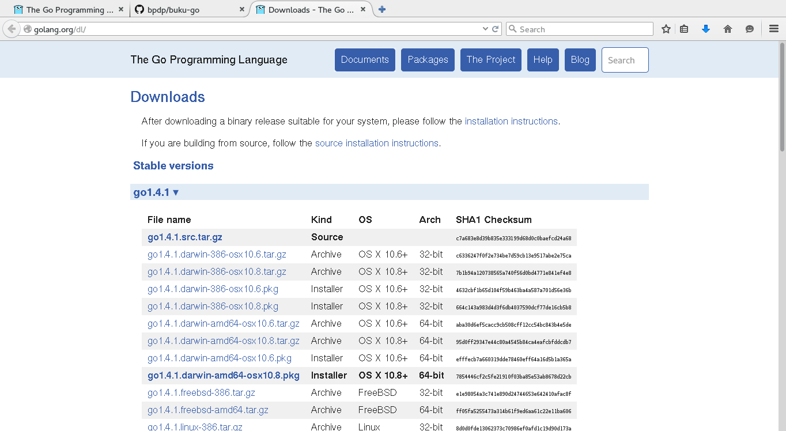

# Pengenalan Go

## Apa itu Go?

Go adalah nama bahasa pemrograman sekaligus nama implementasi dalam bentuk kompilator (`compiler`). Untuk pembahasan berikutnya, istilah `Go` akan mengacu juga pada spesifikasi bahasa pemrograman serta peranti pengembangannya.

## Lisensi Go

Go didistribusikan dengan menggunakan lisensi modifikasi dari BSD. Lisensi lengkap dari Go bisa diakses di [URL Lisensi Go](http://golang.org/LICENSE). Secara umum, penggunaaan lisensi ini mempunyai implikasi sebagai berikut:
* boleh digunakan untuk keperluan komersial maupun non-komersial tanpa batasan
* boleh memodifikasi sesuai keperluan
* boleh mendistribusikan
* boleh memberikan sublisensi ke pihak lain
* boleh memberikan garansi
* tidak boleh menggunakan merk dagang Go
* tanpa jaminan dan jika terjadi kerusakan terkait penggunaan software ini maka pemberi lisensi tidak bisa dituntut
jika mendistribusikan harus mengikutsertakan pemberitahuan hak cipta.

## Instalasi Go

### Distribusi Go

Go tersedia pada berbagai platform. Proyek Go sendiri secara resmi mendukung platform Linux, FreeBSD, MacOSX, dan Windows. Dukungan tersebut merupakan dukungan resmi dan distribusi `binary executable` dari berbagai platform tersebut tersedia di [repository downloads Go](http://golang.org/dl/) seperti bisa dilihat di gambar berikut:

Dengan dukungan tersebut, Proyek Go akan menerima laporan `bugs` terkait dengan distribusi pada berbagai platform tersebut. Meski demikian, bukan berarti platform-platform lain tidak bisa menggunakan Go karena distribusi dalam bentuk kode sumber tersedia dan telah berhasil dikompilasi ke berbagai platform: NetBSD, OpenBSD, DragonFlyBSD, dan lain-lain. Informasi mengenai platform-platform yang mungkin bisa digunakan oleh Go bisa diperoleh di [Wiki](https://code.google.com/p/go-wiki/w/list).

### Download dan Install Go

Meski mendukung banyak platform, di buku ini hanya akan dibahas penggunaan Go di platform Linux. Pada dasarnya peranti pengembang yang disediakan sama. Silahkan menyesuaikan dengan platform yang anda gunakan. Untuk instalasi berikut ini, ambil distribusi yang sesuai dengan platform di komputer anda. Untuk pembahasan ini, digunakan `go1.3.3.linux-386.tar.gz`. Setelah itu, ikuti langkah-langkah pada Listing~\ref{lst:installGo}.

\lstset{language=Go, caption=Download dan install Go, label={lst:installGo}}
\lstinputlisting{src/non-go/bab-01/download-install-go.txt}

\subsection{Konfigurasi Variabel Lingkungan Sistem Operasi}

Go menggunakan beberapa variabel lingkungan sistem operasi. 

\begin{itemize}
	\item \textbf{PATH}:
	\item \textbf{GOROOT}: 
	\item \textbf{GOROOT\_FINAL}: 
	\item \textbf{GOPATH}:
	\item \textbf{GOOS}: 
	\item \textbf{GOARCH}: 
	\item \textbf{GOHOSTOS}: 
	\item \textbf{GOHOSTARCH}: 
	\item \textbf{GOBIN}: 
	\item \textbf{GOARM}:
	\item \textbf{GOEXE}:
	\item \textbf{GOCHAR}:
	\item \textbf{GOGCCFLAGS}:
	\item \textbf{GOTOOLDIR}:
	\item \textbf{CGO\_ENABLED}:
\end{itemize}

Tetapkan nilai-nilai variabel lingkungan tersebut di file inisialisasi shell (penulis menggunakan Bash, sehingga file-file inisialisasi diletakkan di \$HOME/.bashrc). Isikan baris-baris pada Listing~\ref{lst:bashrcGo} di .bashrc:

\lstset{language=Go, caption=Konfigurasi variabel lingkungan, label={lst:bashrcGo}}
\lstinputlisting{src/non-go/bab-01/go-en-var-bash.txt}

\subsection{Menguji Instalasi Go}

Kode sumber Go yang kita buat bisa dijalankan / dieksekusi tanpa harus dikompilasi (jadi seperti script Python atau Ruby) atau bisa juga dikompilasi lebih dulu untuk menghasilkan \textit{binary executable}\footnote{Catatan: selain ini sebenarnya ada paket pustaka yang dimaksudkan untuk digunakan dalam program, akan dibahas belakangan}. 

Untuk menguji, buat program sederhana seperti pada Listing~\ref{lst:helloGo}. Setelah itu, gunakan ``go run namafile.go'' untuk menjalankan secara langsung atau dikompilasi lebih dulu dengan ``go build namafile.go'' seperti pada Listing~\ref{lst:ujiGo}.
	
\lstset{language=Go, caption=hello.go, label={lst:helloGo}}
\lstinputlisting{src/go/bab-01/hello.go}

\lstset{language=bash, caption={Menguji instalasi Go di Linux}, label={lst:ujiGo}}
\lstinputlisting{src/non-go/bab-01/test-instalasi-go.txt}

\begin{mdframed}[style=catatan]
\begin{verbatim}
$ pwd
/tmp/go-build084995351/command-line-arguments/_obj
$ ls -la
total 1528
drwxr-xr-x 2 bpdp bpdp      80 Apr  5 08:55 .
drwxr-xr-x 3 bpdp bpdp      60 Apr  5 08:55 ..
-rwxr-xr-x 1 bpdp bpdp 1538790 Apr  5 08:55 a.out
-rw-r--r-- 1 bpdp bpdp   24345 Apr  5 08:55 _go_.8
$ file a.out 
a.out: ELF 32-bit LSB  executable, Intel 80386, version 1 (SYSV), statically linked, not stripped
$ cd /tmp
$ tree go-build084995351/
go-build084995351/
|-- command-line-arguments
|   \bigcap- _obj
|       |-- a.out
|       \bigcap- _go_.8
\bigcap- command-line-arguments.a

2 directories, 3 files
$
\end{verbatim}
\end{mdframed}

\section{Memahami Lingkungan Peranti Pengembangan Go}

Saat menginstall Go, kita akan memperoleh 3 buah file \textit{binary executable}:
\begin{itemize}
	\item \textbf{go}
	\item \textbf{godoc}
	\item \textbf{gofmt}
\end{itemize}

Penjelasan untuk masing-masing akan diuraikan di sub-sub bab berikut.

\subsection{go}

\textbf{go} merupakan peranti untuk mengelola kode sumber Go yang kita buat. Beberapa argumen dari \textbf{go} adalah:

\lstset{language=bash, caption={Perintah \textbf{go}}, label={lst:perintahGo}}
\lstinputlisting{src/non-go/bab-01/perintah-go.txt}

\subsection{godoc}

\textbf{godoc} merupakan peranti untuk menampilkan dokumentasi paket pustaka standar Go atau menampilkan server untuk dokumentasi Go (mirip seperti yang terdapat pada \url{http://golang.org}).

\lstset{language=bash, caption={Perintah \textbf{godoc}}, label={lst:perintahGodoc}}
\lstinputlisting{src/non-go/bab-01/perintah-godoc.txt}

\subsection{gofmt}

\textbf{gofmt} merupakan peranti untuk mem-format kode sumber dalam bahasa pemrograman Go yang kita buat.

\lstset{language=bash, caption={Perintah \textbf{gofmt}}, label={lst:perintahGofmt}}
\lstinputlisting{src/non-go/bab-01/perintah-gofmt.txt}
