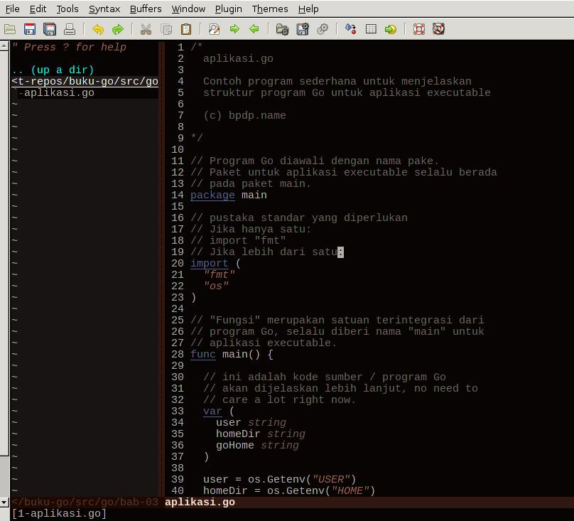
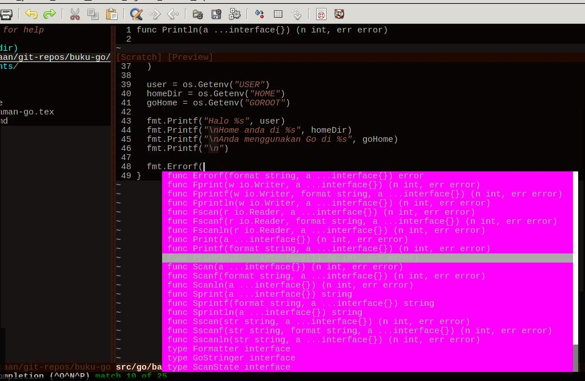

# IDE Untuk Go

[[ Daftar Isi ]](README.md) [[ Awal ]](../README.md)

IDE (`Integrated Development Environment`) merupakan software yang digunakan oleh pemrogram dan pengembang software untuk membangun software. IDE berisi berbagai fasilitas komprehensif yang diperlukan para pemrogram untuk membantu mereka dalam membangun software aplikasi. Secara minimal, biasanya IDE terdiri atas editor teks (untuk mengetikkan kode sumber), debugger (pencari bugs), `syntax highlighting, code completion, serta dokumentasi / help. Bab ini akan membahas beberapa software yang bisa digunakan. Sebenarnya menggunakan editor teks yang menghasilkan file text / ASCII murni sudah cukup untuk bisa menuliskan kode sumber dan kemudian mengkompilkasi. Pada bab ini akan dibahas [Vim](http://www.vim.org) sebagai editor teks dan LiteIDE sebagai software IDE yang lebih lengkap untuk Go, tidak sekedar hanya untuk menuliskan kode sumber.

## Menggunakan Vim

Untuk menggunakan Vim, ada plugin utama serta berbagai plugin pendukung yang bisa digunakan. Sebaiknya, menggunakan `pathogen` untuk mempermudah pengelolaan berbagai plugin tersebut. Bagian ini akan menjelaskan berbagai konfigurasi serta instalasi yang diperlukan sehingga Vim bisa menjadi peranti untuk pengembangan aplikasi menggunakan Go.

## Instalasi dan Konfigurasi Pathogen

Pathogen adalah plugin dari Tim Pope yang digunakan untuk mempermudah pengelolaan plugin. Kode sumber dari Pathogen bisa diperoleh di [repository Github](https://github.com/tpope/vim-pathogen). Untuk instalasi, ikuti langkah berikut:

~~~bash
$ cd
$ mkdir .vim/autoload
$ mkdir .vim/bundle
$ cd .vim/autoload
$ wget -c  https://raw.github.com/tpope/vim-pathogen/master/autoload/pathogen.vim
--2014-12-06 22:56:07--  https://raw.github.com/tpope/vim-pathogen/master/autoload/pathogen.vim
Resolving raw.github.com (raw.github.com)... 103.245.222.133
Connecting to raw.github.com (raw.github.com)|103.245.222.133|:443... connected.
HTTP request sent, awaiting response... 301 Moved Permanently
Location: https://raw.githubusercontent.com/tpope/vim-pathogen/master/autoload/pathogen.vim [following]
--2014-12-06 22:56:14--  https://raw.githubusercontent.com/tpope/vim-pathogen/master/autoload/pathogen.vim
Resolving raw.githubusercontent.com (raw.githubusercontent.com)... 103.245.222.133
Connecting to raw.githubusercontent.com (raw.githubusercontent.com)|103.245.222.133|:443... connected.
HTTP request sent, awaiting response... 200 OK
Length: 12139 (12K) [text/plain]
Saving to: ‘pathogen.vim’

pathogen.vim                          100%[========================================================================>]  11.85K  --.-KB/s   in 0.1s   

2014-12-06 22:56:14 (85.9 KB/s) - ‘pathogen.vim’ saved [12139/12139]
~~~

Setelah itu, untuk menggunakan Pathogen, letakkan aktivasinya di `$HOME/.vimrc` atau di `$HOME/.vim/vimrc` (saya pilih lokasi yang kedua) sebagai berikut:

~~~bash
execute pathogen#infect()
~~~

Setelah itu, semua plugin tinggal kita ambil dari repository (bisa dari github, bitbucket, dan lain-lain) langsung di-copy satu direktori ke direktori `$HOME/.vim/bundle`.

##  Instalasi dan Kofigurasi Plugin Golang dan Plugin Pendukung

Setelah selesai melakukan instalasi Pathogen, berbagai plugin yang diperlukan bisa diambil langsung dari Internet. Berikut ini adalah daftar yang digunakan penulis:

* Colorschemes: untuk tema warna dari Vim. Bisa diperoleh di https://github.com/flazz/vim-colorschemes
* Nerdtree: untuk menampilkan file-file dalam struktur pohon di sebelah kiri sehingga memudahkan navigasi. Bisa diperoleh di https://github.com/scrooloose/nerdtree
* Golang: plugin utama agar Vim mengenali kode sumber Go. Bisa diperoleh di https://github.com/jnwhiteh/vim-golang.git

Cara instalasi:

~~~bash
$ cd 
$ cd .vim/bundle
$ git clone <masing-masing lokasi plugin>
~~~

Hasil dari menjalankan ``vim'' atau ``gvim'' melalui shell untuk menulis kode sumber Go bisa dilihat pada gambar berikut ini:

## Autocompletion

Vim menyediakan fasilitas `autocompletion` melalui `Omniautocompletion`. Fasilitas ini sudah terinstall saat kita menginstall Vim. Untuk mengaktifkan fasilitas ini untuk keperluan Go, kita harus menginstall dan mengaktifkan [Gocode](https://github.com/nsf/gocode). Sebaiknya source code dari Gocode diambil semua karena ada script Vim yang akan kita gunakan:

~~~
$ git clone https://github.com/nsf/gocode.git
Cloning into 'gocode'...
remote: Counting objects: 2491, done.
remote: Compressing objects: 100% (1128/1128), done.
remote: Total 2491 (delta 1323), reused 2449 (delta 1295)
Receiving objects: 100% (2491/2491), 1.07 MiB | 17 KiB/s, done.
Resolving deltas: 100% (1323/1323), done.
$
~~~

Setelah itu, install Gocode menggunakan perintah `go get -u github.com/nsf/gocode`. Hasilnya dari perintah tersebut adalah file `executable binary` `\$GOROOT/bin/gocode`. Sebelum menggunakan Vim, aktifkan dulu gocode dengan mengeksekusi `gocode` melalui shell. Setelah itu, tambahkan satu baris di `$HOME/.vim/vimrc`: `set ofu=syntaxcomplete#Complete` di bawah baris `filetype plugin indent on`.

Kode sumber lengkap dari \$HOME/.vim/vimrc yang penulis gunakan bisa dilihat pada listing adalah sebagai berikut:

~~~vim
execute pathogen#infect()

syntax on
filetype plugin indent on
set ofu=syntaxcomplete#Complete

if has("gui_running")
	colorscheme asmanian_blood
else
	colorscheme slate
endif

set smartindent
set tabstop=2
set shiftwidth=2
set expandtab

autocmd vimenter * NERDTree
autocmd vimenter * if !argc() | NERDTree | endif
autocmd bufenter * if (winnr("$") == 1 && exists("b:NERDTreeType") && b:NERDTreeType == "primary") | q | endif

let g:NERDTreeDirArrows=0

let g:cssColorVimDoNotMessMyUpdatetime = 1
set guifont=Liberation\ Mono\ 11

set number
set numberwidth=4
set cpoptions+=n
highlight LineNr term=bold cterm=NONE ctermfg=DarkGrey ctermbg=NONE gui=NONE guifg=DarkGrey guibg=NONE

set grepprg=grep\ -nH\ $*
~~~

Untuk mengaktifkan completion, kita harus masuk ke mode `Insert` dari Vim, setelah itu tekan `Ctrl-X, Ctrl-O` secara cepat. Hasil `autocompletion` bisa dilihat di gambar berikut ini:

## Menggunakan LiteIDE

LiteIDE dibuat oleh visualfc dan tersedia dalam bentuk kode sumber maupun binary. Kode sumber bisa diperoleh di [repo Google](https://github.com/visualfc/liteide). Installer executable bisa diperoleh di [Sourceforge](http://sourceforge.net/projects/liteide/files)

Instalasi di Linux sangat mudah, hanya tinggal mengekstrak file yang kita download (saat ini versi terakhir adalah versi X25) pada suatu direktori dan jika ingin menjalankan cukup dengan mengeksekusi file `$LITEIDE_HOME/bin/liteide` (`cd $LITEIDE_HOME/bin; ./liteide &`)

## Software IDE Lain

Vim dan LiteIDE hanyalah beberapa peranti yang bisa digunakan oleh pengembang. Distribusi Go juga menyediakan dukungan untuk berbagai peranti lunak lain:

* Emacs. Dukungan untuk Go diwujudkan dalam fasilitas `add-on`. Untuk Emacs 24 ke atas, bisa diinstall melalui manajer paket (M-x package-list-packages), cari dan install `go-mode`. Emacs juga mendukung `gocode` untuk `completion`.
* Eclipse. Dukungan untuk Go diwujudkan melalui plugin `goclipse`, bisa diperoleh di https://code.google.com/p/goclipse/.
* Selain software-software yang telah disebutkan, rata-rata IDE / Editor sudah mempunyai dukungan terhadap bahasa pemrograman Go (JEdit, Sublime-text, Notepad++, dan lain-lain).

[[ Daftar Isi ]](README.md) [[ Awal ]](../README.md)
